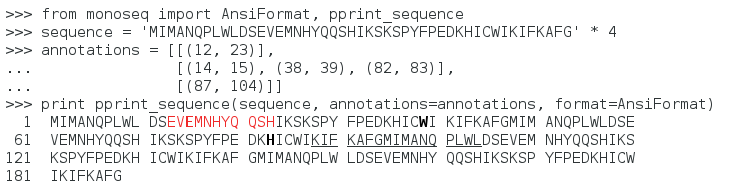

``monoseq``
===========

``monoseq`` is a Python library for pretty-printing sequence strings using a
monospace font. It also provides a simple command line interface.

Sequences are pretty-printed in the for DNA and proteins traditional way
using blocks of letters where each line is prefixed with the sequence
position. User-specified regions are highlighted using different formatting
styles. The output format can be HTML or plaintext with optional styling
using ANSI escape codes for use in a UNIX terminal.

.. code-block:: pycon

    >>> import monoseq
    >>> sequence = 'MIMANQPLWLDSEVEMNHYQQSHIKSKSPYFPEDKHICWIKIFKAFGT' * 4
    >>> print monoseq.pprint_sequence(sequence, mode='plaintext')
      1  MIMANQPLWL DSEVEMNHYQ QSHIKSKSPY FPEDKHICWI KIFKAFGTMI MANQPLWLDS
     61  EVEMNHYQQS HIKSKSPYFP EDKHICWIKI FKAFGTMIMA NQPLWLDSEV EMNHYQQSHI
    121  KSKSPYFPED KHICWIKIFK AFGTMIMANQ PLWLDSEVEM NHYQQSHIKS KSPYFPEDKH
    181  ICWIKIFKAF GT

To install the latest release via PyPI using pip::

    pip install monoseq

Documentation
-------------

The `latest documentation <https://monoseq.readthedocs.org/>`_ with user
guide and API reference is hosted at Read The Docs.

You can also compile the documentation directly from the source code by
running ``make html`` from the ``doc/`` subdirectory. This requires
`Sphinx`_ to be installed.

Copyright
---------

``monoseq`` is licensed under the MIT License, see the LICENSE.rst file
for details. See the AUTHORS.rst file for a list of authors.

.. _Sphinx: http://sphinx-doc.org/
